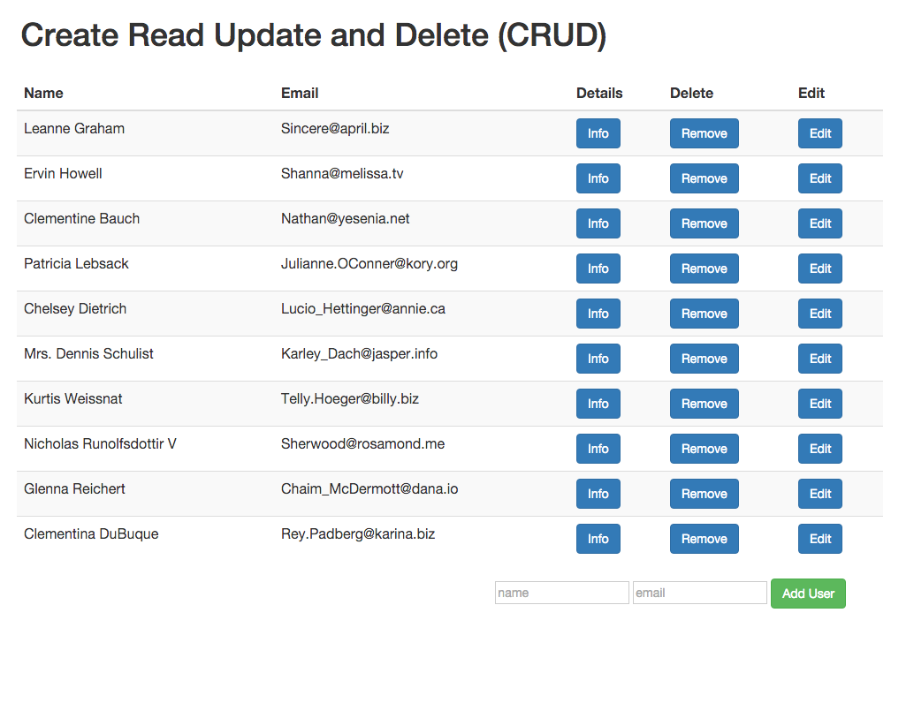
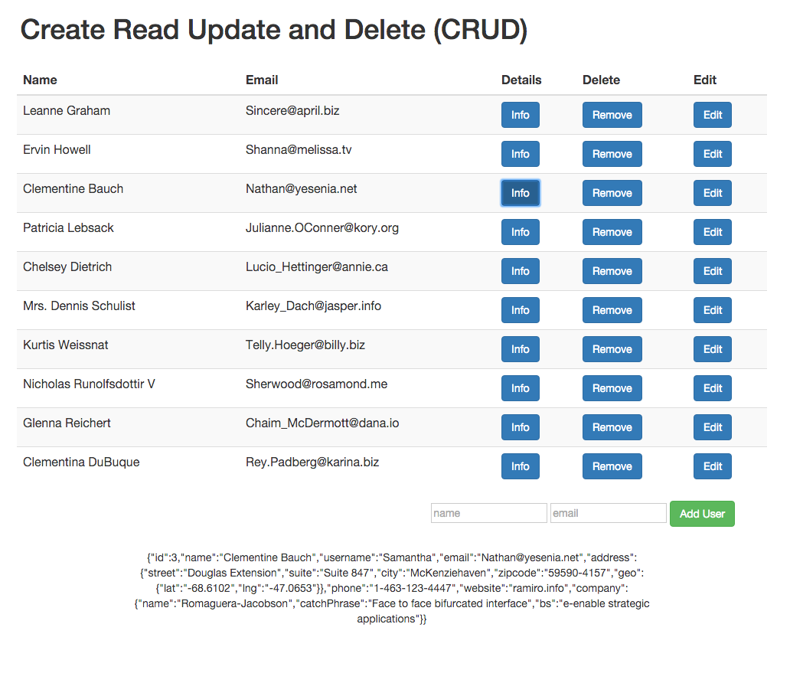

# RestCall-AngularJS
I've tried to make the simplest REST call using Angular $resource.

## Interface

## User details



## Objectives of exercise
The aim of this project is to user AngularJS Resource instead of the default
$http privider to perform a REST call. For the purpose of the project I have
used [Json placeholder](http://jsonplaceholder.typicode.com/users/) to retrieve
data.
Only because the Json placeholder doesn't allow to modify the date, once you hit
the button update the actual data won't be modified, but you can see the Update
working going to inspect/Network.
Just as a practice I have used Angular in order to delete the item form the
list, by splice[$index, 1] function.
If you want to Edit an user you should use the same input filed at the botton to
create a new user.

## Technologies used
* Javascript
* AngularJS
* jsonplaceholder


## How to run locally
```
$ git clone https://github.com/Mattia46/RestCall-AngularJS
$ open index.html
```

